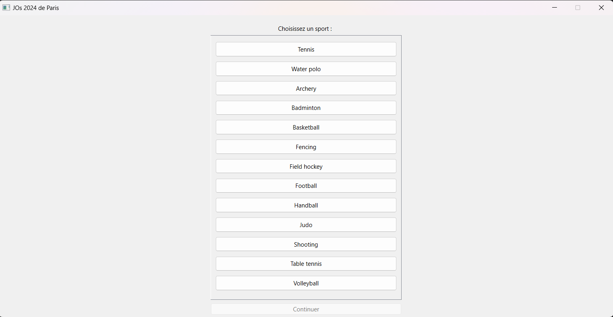
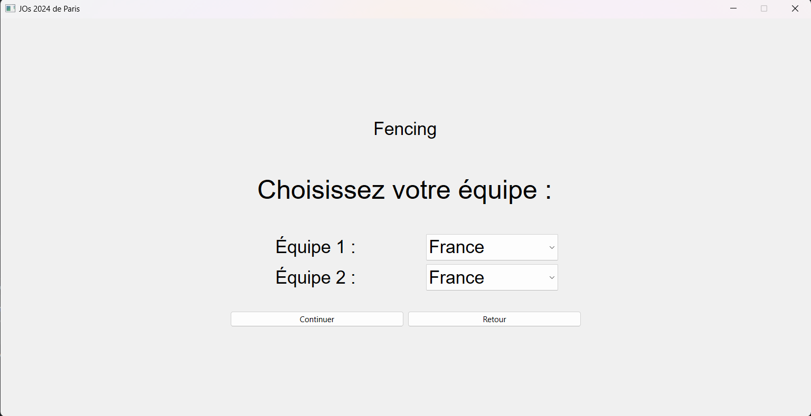
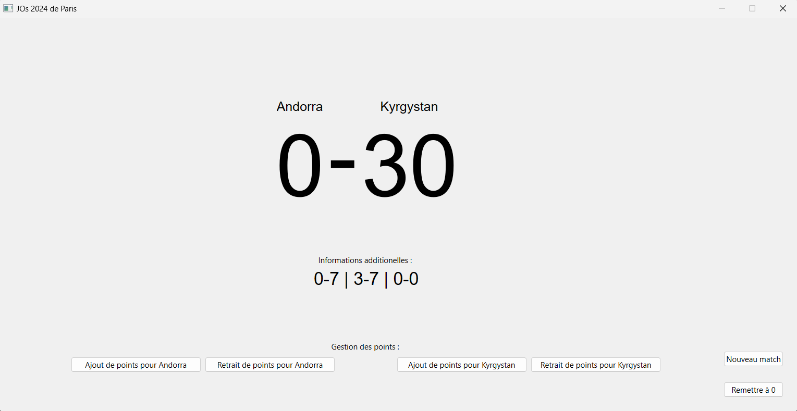

Application faite avec Qt6 en python

/!\ Pour lancer le programme il faut avoir PySide6 (pip install pyside6).

Cahier des charges :

- Affichage des points
- Choix du sport
- choix des équipes (+ ajout si assez de temps)
- Documentation qui explique le fonctionnement de l'application

DEADLINE -> 11/12

 

---------------- APRÈS DEADLINE ----------------

Images du programme :

Fait :
- Affichage des points
- Choix du sport
- Choix des équipes
- Utilisation de base de données

Non fait :
- système de gestion des équipes
- Documentation qui explique le fonctionnement de l'app.

À retenir :
- Utilisation de Qt fastidieuse  
  -> Utiliser des classes pour limiter la répétition  
  -> Utiliser JS/HTML/CSS à la place  
- Mieux prévoir l'implémentation du score en fonction des sports car format très différent suivant les sports
 
